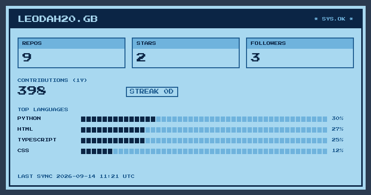
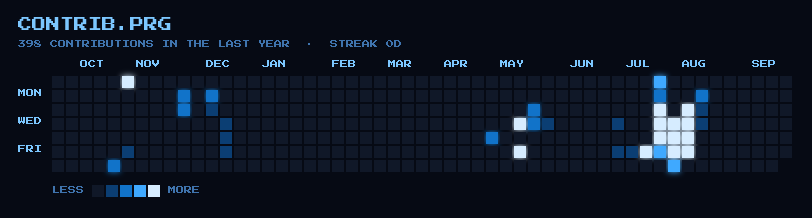

 

`> LOAD "ABOUT.PRG",8,1`

Graduado em Ciência da Computação (UNIP, 2022–2026), full-stack por
formação e hoje também de infraestrutura/redes na rotina (Analista de
Redes Jr. na Build Engenharia). No dia a dia transito entre mobile,
backend, IA aplicada e redes — os projetos abaixo contam melhor essa
história do que qualquer lista de skills.

`TYPESCRIPT` · `PYTHON` · `CLEAN ARCHITECTURE` · `C2 ENGLISH` · `LINUX & OPEN SOURCE`

`> LOAD "STATS.PRG",8,1` — auto-atualiza a cada 6h via GitHub Actions

Cartucho gerado por script proprio (<a href="scripts/generate_assets.py">scripts/generate_assets.py</a>) rodando em <a href=".github/workflows/update-tracker.yml">GitHub Actions</a> a cada 6h — nao e um badge de terceiro, e nao e "tempo real" no sentido literal (um README estatico nao roda JS), mas o mais perto disso que da pra fazer sem backend.

`> LOAD "FEED.PRG",8,1` — status dos repositórios em desenvolvimento, auto-atualizado pelo mesmo script

<!-- FEED:START -->

| Projeto | Linguagem | Última atividade | Status |
|---|---|---|---|
| [`pokemon-trainer-companion`](https://github.com/leodah20/pokemon-trainer-companion) | TypeScript | hoje | 🟢 Em desenvolvimento |
| [`linkedin-connect-ai`](https://github.com/leodah20/linkedin-connect-ai) | Python | hoje | 🟢 Em desenvolvimento |
| [`TCC-ChatBotAcademico`](https://github.com/leodah20/TCC-ChatBotAcademico) | Python | há 2d | 🟢 Em desenvolvimento |
| [`smc-portfolio`](https://github.com/leodah20/smc-portfolio) | Python | há 4d | 🟢 Em desenvolvimento |
| [`leodah20.github.io`](https://github.com/leodah20/leodah20.github.io) | CSS | há 5d | 🟢 Em desenvolvimento |
| [`APS`](https://github.com/leodah20/APS) | HTML | há 5d | 🟢 Em desenvolvimento |
| [`projetin`](https://github.com/leodah20/projetin) | — | há 3m | ⚪ Pausado |
| [`chatbot-front`](https://github.com/leodah20/chatbot-front) | HTML | há 7m | ⚪ Pausado |

Auto-gerado via API do GitHub pelo mesmo script do tracker acima — sem curadoria manual. Última sincronização: 2026-07-15 18:53 UTC

<!-- FEED:END -->

`> LOAD "PROJECTS.PRG",8,1`

### 🎮 pokemon-trainer-companion

App companion pra Pokémon GO: calculadoras de IV/batalha via overlay com
OCR de screenshot (nunca toca o client ou a conta do jogo — ToS-safe por
design), mais um "Pokédex parceiro" de lore/trivia opcional. React Native
(TypeScript, bare workflow) + NestJS + Prisma + PostgreSQL, Clean
Architecture nas duas pontas.

[`repo`](https://github.com/leodah20/pokemon-trainer-companion)

### 🤝 linkedin-connect-ai

Assistente com IA pra priorizar e personalizar convites de conexão no
LinkedIn: extensão de navegador roda na sua própria sessão logada,
backend analisa cada perfil com um LLM contra objetivos de carreira
configuráveis. Sem senha armazenada, limite diário de envios, revisão
humana obrigatória pra casos de aderência incerta.

[`repo`](https://github.com/leodah20/linkedin-connect-ai)

### 🎓 TCC-ChatBotAcademico

Chatbot acadêmico do TCC de graduação: FastAPI/Flask + Rasa. Professores
sobem material didático via painel administrativo, sistema disponibiliza
um assistente IA 24/7 pra alunos. Consolida em um único repo o que antes
estava dividido em `chatbot-front` / `chatbot_rasa` / `ChatBot_API`
(mantidos no perfil como histórico, não mais ativos).

[`repo`](https://github.com/leodah20/TCC-ChatBotAcademico) · [`demo do front`](https://leodah20.github.io/chatbot-front-demo/)

`> LOAD "TECHSTACK.PRG",8,1`

**Full-Stack & Mobile**

**Backend & IA**

**Redes & Infra** (rotina como Analista de Redes Jr.)

**Tooling**

---

**G A M E   O V E R**
`CONTINUE? > github.com/leodah20 · linkedin.com/in/leonardo-cordeiro-sutil`

